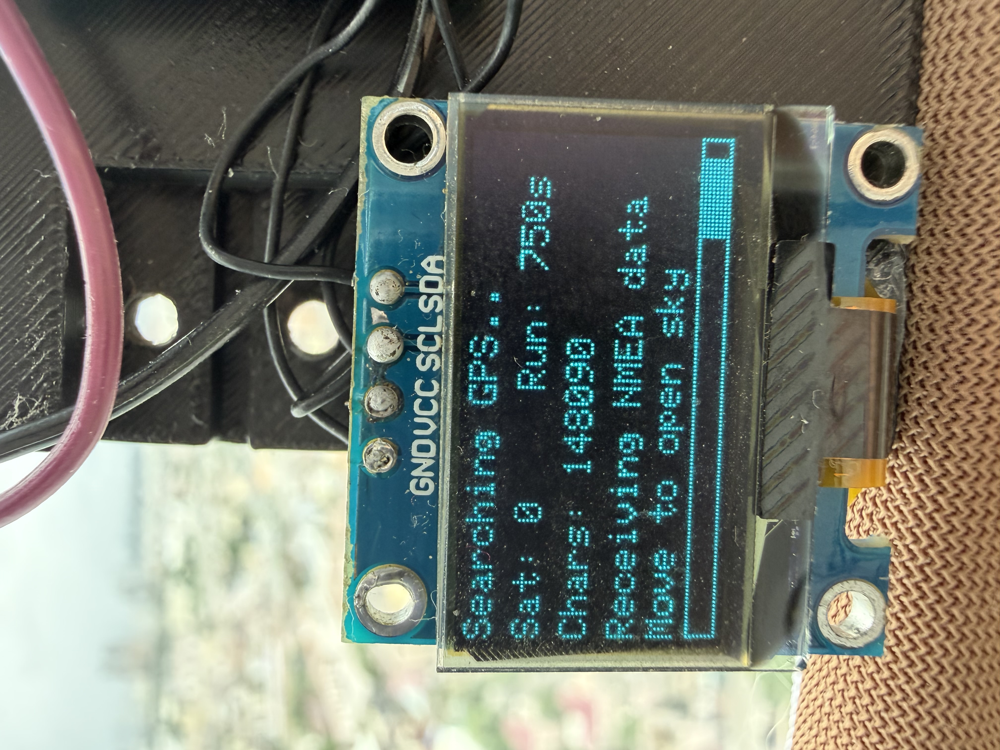
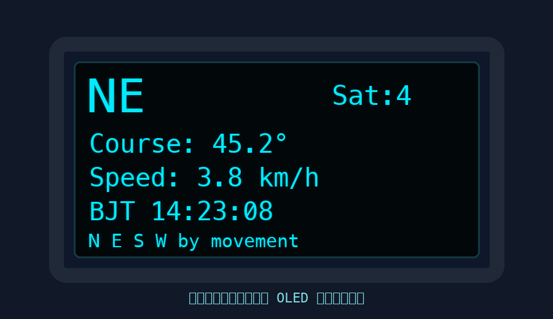

# NodeMCU D1 mini OLED GPS

这是一个 Arduino IDE 草图，用于测试 NodeMCU/Wemos D1 mini、0.96 寸 SSD1306 I2C OLED 屏幕和 NEO-6M GPS 模块。

程序会在 OLED 上显示 GPS 搜星状态；定位成功后显示移动方向、方向角、速度和北京时间。

## 功能

- 未定位时显示搜星动画、运行时间、GPS 数据字符数和卫星数量。
- 如果超过 5 秒没有收到 GPS 数据，显示 `No GPS data`，方便排查接线、电源或串口问题。
- 定位成功后显示：
  - 移动方向：`N / NE / E / SE / S / SW / W / NW`
  - 航向角度：例如 `85.3°`
  - 速度：`km/h`
  - 北京时间：由 GPS UTC 时间转换为 UTC+8
- 串口监视器会输出 GPS 字符数、卫星数、定位状态、经纬度等调试信息。

## 接线

### OLED 0.96 I2C

| OLED 引脚 | D1 mini 引脚 |
| --- | --- |
| GND | GND |
| VCC | 3.3V |
| SCL | D1 / GPIO5 |
| SDA | D2 / GPIO4 |

### NEO-6M GPS

| GPS 引脚 | D1 mini 引脚 |
| --- | --- |
| GND | GND |
| VCC | 按模块支持接 3.3V 或 5V |
| TX | D5 / GPIO14 |
| RX | D6 / GPIO12，可选 |

如果不确定 GPS 模块的 RX 是否支持 3.3V 逻辑，可以不接 GPS RX。只接 `GPS TX -> D5` 就能读取定位数据。

## 显示效果

未定位时，OLED 会持续显示搜星动画、运行时间、GPS 数据字符数和搜星提示，避免误以为系统卡住。



定位成功后，OLED 会切换到移动指南针页面，显示移动方向、航向角、速度和北京时间。



## 天线摆放

GPS 陶瓷贴片天线需要让**方形陶瓷片的大平面朝天空**，PCB 和焊点那面朝下。不要让天线侧着、朝墙、贴着金属或被屏幕/支架/人体遮挡。

建议第一次冷启动时，把 GPS 天线放到窗外、阳台外沿或户外开阔处，等待 5–15 分钟。

## Arduino IDE 配置

1. 安装 ESP8266 开发板包。
2. 选择开发板：`LOLIN(WEMOS) D1 R2 & mini` 或兼容 D1 mini 的开发板。
3. 在 Library Manager 安装这些库：
   - `TinyGPSPlus`
   - `Adafruit GFX Library`
   - `Adafruit SSD1306`
4. 打开 `oled_gps.ino`。
5. 编译并上传到 D1 mini。
6. 打开串口监视器，波特率选择 `115200`。

## arduino-cli 编译

如果已经安装 `arduino-cli`，可以在当前目录运行：

```bash
arduino-cli compile --fqbn esp8266:esp8266:d1_mini /Users/luckmiracle/Documents/oled_gps
```

## 显示说明

### 未定位

屏幕会显示类似：

```text
Searching GPS..
Sat: 0      Run: 250s
Chars: 148090
Receiving NMEA data
Move to open sky
[progress bar]
```

含义：

- `Receiving NMEA data`：GPS 串口通信正常，模块正在输出数据。
- `Chars` 持续增加：D1 mini 正在持续读取 GPS 数据。
- `Sat: 0`：暂时还没有可用卫星，或者还没解析到卫星信息。
- `No GPS data`：没有收到 GPS 串口数据，需要检查 TX/RX、电源和波特率。

### 已定位

屏幕会显示类似：

```text
NE     Sat:4
Course: 45.2°
Speed: 3.8 km/h
BJT 14:23:08
N E S W by movement
```

注意：这个“指南针”是 GPS 移动方向，不是真正的磁力指南针。设备静止时 GPS 无法知道板子正面朝哪里，所以速度低于约 1 km/h 时会提示 `move >1km/h`。

如果想在静止时也显示板子朝向，需要额外添加磁力计模块，例如 `QMC5883L`、`HMC5883L` 或 `GY-271`。
